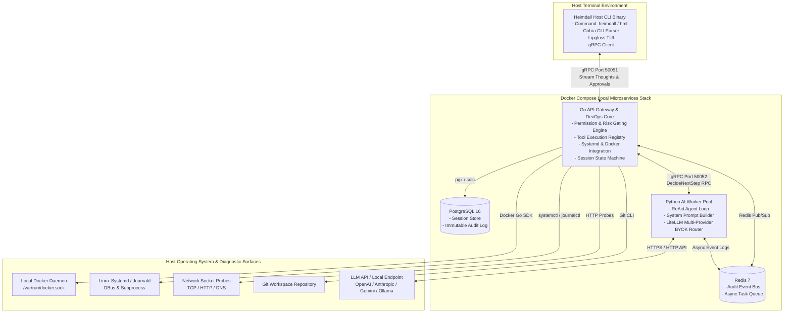

# Heimdall (`hml`) — Enterprise Agentic DevOps CLI & Triage Engine

[](docs/PRD.md)
[](docs/PRD.md)
[](database/migrations/)
[](proto/agent_service.proto)

**Heimdall** (terminal binary: `heimdall` / official short alias: `hml`) is an autonomous, agentic DevOps CLI and triage engine built for software engineers, SREs, and DevOps teams. Named after the all-seeing guardian who guards Asgard's gates and signals incidents, **Heimdall automates repetitive investigative toil** during local infrastructure failures, container crash-loops, network misconfigurations, and systemd service outages.

Rather than running rigid scripts or forcing humans to manually execute complex decision trees across `docker`, `journalctl`, `curl`, and `kubectl`, **Heimdall runs an adaptive reasoning → tool execution → observation → hypothesis validation loop** to isolate root causes and propose verified remediations.

---

## 🌟 Terminal Ergonomics & `hml` Alias

Heimdall compiles to a fast Go binary `heimdall` and sets up **`hml`** (**H**ei**m**da**l**l) as its official 3-letter terminal alias:

```bash
# Full command:
heimdall "why is my web container crash-looping?"

# Official 3-letter terminal alias:
hml "why is my web container crash-looping?"
```

---

## 🌟 Architectural Moat & Engineering Guarantees

1. **Deterministic Safety Gating (Code-Level, Non-Bypassable)**: The AI reasoning worker *cannot* execute system commands directly. Risk classification (`READ_ONLY`, `SAFE_WRITE`, `DANGEROUS`) is evaluated by a compiled Go permission engine. Unapproved destructive actions are physically blocked before reaching the host shell or Docker daemon.
2. **Polyglot High-Performance Architecture**: 
   - **Go**: Powers the fast host CLI client (`hml`/`heimdall`), API Gateway, permission engine, Docker Go SDK, Linux systemd DBus/subprocess execution, and `sqlc` database layer.
   - **Python**: Handles AI/LLM integrations, prompt engineering, structured Pydantic schemas, and provider-agnostic agent reasoning loops via `litellm` (supporting OpenAI, Anthropic Claude, Google Gemini, Groq, or local Ollama/vLLM models).
3. **Grounded Observation (Zero Hallucination)**: System state is strictly derived from actual tool outputs (`docker inspect`, `journalctl`, HTTP probes), logged and verified turn-by-turn.
4. **Immutable Audit Trail**: Every prompt, intermediate thought, proposed tool call, risk score, human confirmation, tool stdout/stderr, and final diagnosis is transactionally committed to **PostgreSQL 16**.

---

## 📐 System Architecture



---

## 🛠️ Tech Stack & Microservices Breakdown

- **Host CLI**: Go 1.22+ (`spf13/cobra`, `charmbracelet/lipgloss`) — Binary: `heimdall`, Alias: `hml`
- **API Gateway & Core Orchestrator**: Go 1.22+ (`gRPC`, `net/http`, `jackc/pgx/v5`, `docker/docker/client`)
- **AI Worker Pool**: Python 3.11+ (`grpcio`, `anthropic`, `pydantic`, `litellm`)
- **Inter-Service Communication**: gRPC over HTTP/2 with Protocol Buffers v3 (`proto/agent_service.proto`)
- **Database & Data Access**: PostgreSQL 16 with `golang-migrate` versioning and `sqlc` type-safe query generation
- **Message Broker & Queue**: Redis 7 Alpine
- **Containerization**: Docker & Docker Compose v2

---

## 🔒 3-Tier Permission & Safety Model

| Tier | Behavior | Example Diagnostic Tools |
|---|---|---|
| **`READ_ONLY`** | Auto-approved, logged to DB | `docker_list_containers`, `docker_inspect`, `docker_logs`, `systemd_status`, `net_http_probe` |
| **`SAFE_WRITE`** | Requires interactive confirmation `[y/N]` | `docker_restart`, scaling dev deployments, clearing cache |
| **`DANGEROUS`** | Requires explicit confirmation + impact summary | `docker_remove`, stopping host systemd services, dropping volumes |

---

## 🚀 Quickstart & Local Setup

### 1. Prerequisites
- Docker & Docker Compose v2 installed
- Go 1.22+ installed
- Python 3.11+ installed
- LLM API Key or Local Endpoint (e.g. `export OPENAI_API_KEY="your-key"` or `export ANTHROPIC_API_KEY="your-key"`, or `export OPENAI_API_BASE="http://localhost:11434/v1"` for local Ollama)

### 2. Start the Local Microservices Stack
```bash
# Clone repository
git clone https://github.com/raghavdev/heimdall.git
cd heimdall

# Start PostgreSQL, Redis, Python AI Worker, and Go Gateway
docker compose up -d

# Check stack health
docker compose ps
```

### 3. Run an Investigation via `hml`
```bash
# Build and install heimdall & hml alias
make install

# Run investigation using official 3-letter alias hml
hml "why is my container crashing?"
```

---

## 📚 Documentation Sitemap

- 📄 **[PRD & Technical Specification](docs/PRD.md)** — Complete Product Requirement Document for Heimdall written from an AI Startup Founder perspective.
- 📄 **[Architecture & Threat Model](docs/architecture.md)** — In-depth microservices architecture design, threat modeling, and gRPC interface specifications.
- 📄 **[Mental Model & Roadmap](docs/agentic-devops-cli.md)** — Core mentor-style guide explaining the paradigm shift from traditional CLI tools to agentic loops.

---

## 📄 License
Apache 2.0 License. See [LICENSE](LICENSE) for details.
