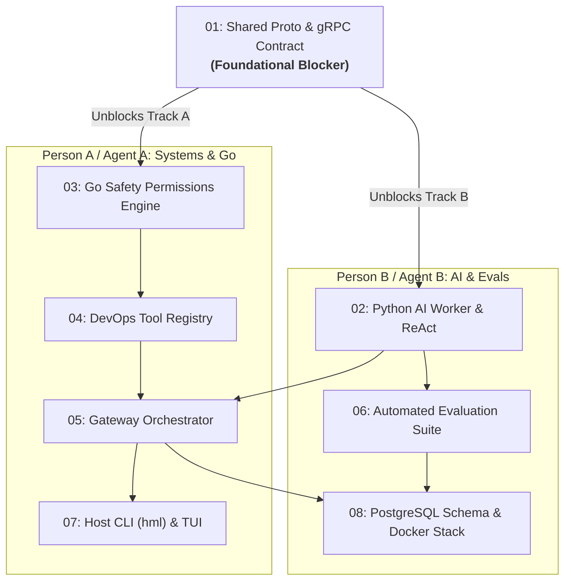

# Heimdall (`hml`) Project Ticket Tracker

> **Multi-Agent / 2-Person Tracking Board**  
> Use this document to coordinate work between 2 developers / agents. Mark checkboxes `[x]` when an issue meets all its acceptance criteria and passes verification.

> [!IMPORTANT]
> **Persistent Agent Memory Rule**: After completing any ticket implementation and passing tests, the working agent **MUST immediately mark the ticket as complete** in this document (`[ ]` → `[x]`) and in the ticket's issue file under `.scratch/heimdall/issues/`. Never end an implementation session without updating ticket status.

---

## 👥 Team Workstreams & Ownership

| Workstream | Owner / Agent | Primary Scope | Assigned Tickets |
|---|---|---|---|
| **Foundation** | **raadhika-N** | Protobuf IPC Contract & Build Setup | [01](#01-shared-protocol-buffer--grpc-ipc-contract) |
| **Track A: Systems & Go** | **raadhika-N** | Permission Engine, Tool Registry, Gateway Loop, Host CLI (`hml`) | [03](#03-deterministic-safety-gating--risk-matrix-in-go), [04](#04-devops-diagnostic-tool-registry-docker--systemd), [05](#05-gateway-turn-orchestrator--session-loop), [07](#07-interactive-host-cli-heimdall--hml--lipgloss-tui) |
| **Track B: AI & Evals** | **Person B / Agent B** | Python Worker, Claude 3.5 Sonnet ReAct, Benchmark Evals, Docker Stack | [02](#02-python-ai-worker-react-reasoning-engine--tool-calling), [06](#06-automated-evaluation-benchmark-suite-oom--safety-gating), [08](#08-postgresql-16-audit-persistence--docker-stack-integration) |

---

## 📊 Dependency Graph & Concurrency Map

---

## 📋 Ticket Status Checklist

| Done | ID | Title | Assigned | Blocked By | Status | Details |
|:---:|:---:|---|:---:|:---:|:---:|:---:|
| [x] | **01** | Shared Protocol Buffer & gRPC IPC Contract | **raadhika-N** | None | `complete` | [Issue 01](.scratch/heimdall/issues/01-grpc-ipc-contract.md) |
| [ ] | **02** | Python AI Worker ReAct Reasoning Engine | **Agent B** | `01` | `ready-for-agent` | [Issue 02](.scratch/heimdall/issues/02-python-ai-worker.md) |
| [ ] | **03** | Deterministic Safety Gating & Risk Matrix in Go | **raadhika-N** | `01` | `ready-for-agent` | [Issue 03](.scratch/heimdall/issues/03-go-safety-permissions.md) |
| [ ] | **04** | DevOps Diagnostic Tool Registry (Docker & Systemd) | **raadhika-N** | `03` | `ready-for-agent` | [Issue 04](.scratch/heimdall/issues/04-devops-tools-registry.md) |
| [ ] | **05** | Gateway Turn Orchestrator & Session Loop | **raadhika-N** | `02`, `04` | `ready-for-agent` | [Issue 05](.scratch/heimdall/issues/05-gateway-orchestrator.md) |
| [ ] | **06** | Automated Evaluation Benchmark Suite | **Agent B** | `02` | `ready-for-agent` | [Issue 06](.scratch/heimdall/issues/06-eval-benchmark-suite.md) |
| [ ] | **07** | Interactive Host CLI (`heimdall` / `hml`) & TUI | **raadhika-N** | `05` | `ready-for-agent` | [Issue 07](.scratch/heimdall/issues/07-host-cli-lipgloss-tui.md) |
| [ ] | **08** | PostgreSQL 16 Audit Persistence & Docker Stack | **Agent B** | `05`, `06` | `ready-for-agent` | [Issue 08](.scratch/heimdall/issues/08-postgres-docker-stack.md) |

---

## 🎯 How Agents Should Work This Board

1. **Check the Frontier**:
   Any ticket whose **Blocked By** tickets are marked `[x]` can be immediately picked up.
   - Initial Frontier: **Ticket 01** can start immediately.
   - Once Ticket 01 is `[x]`, both **Ticket 02 (Agent B)** and **Ticket 03 (Agent A)** can run simultaneously in separate sessions/agents.
2. **Context Hygiene**:
   Run each ticket in a fresh context window. Each ticket under `.scratch/heimdall/issues/` is completely self-contained with its own acceptance criteria.
3. **Completion**:
   Once all checkboxes inside `.scratch/heimdall/issues/<NN>-*.md` pass tests, mark the corresponding row in `TICKETS.md` as `[x]`.
